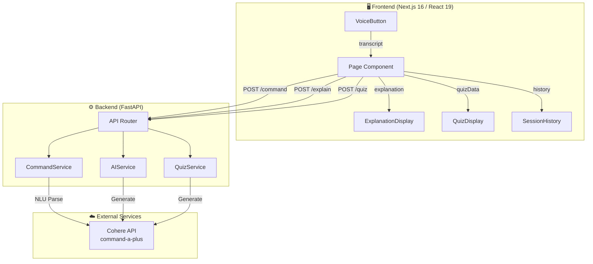
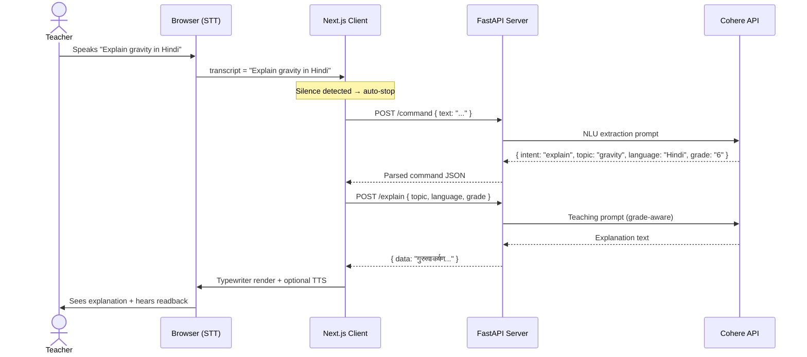
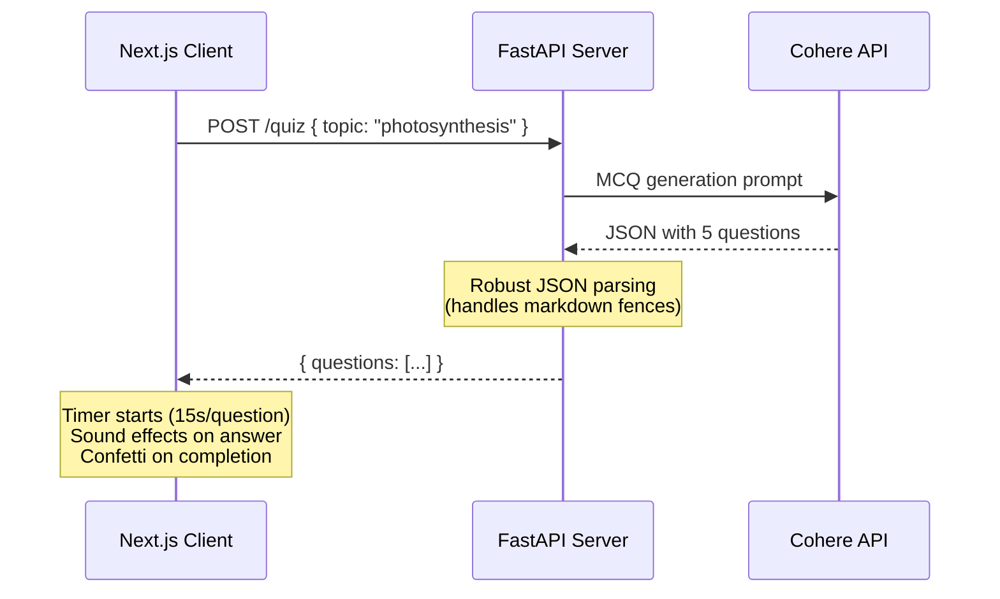

<div align="center">

# 🎓 Shiksha AI

### Voice-Powered AI Teaching Assistant for Smart Classrooms

[](https://nextjs.org/)
[](https://fastapi.tiangolo.com/)
[](https://cohere.com/)
[](https://react.dev/)
[](https://python.org/)
[](https://docker.com/)
[](LICENSE)

**Shiksha AI** is a production-grade, voice-first AI teaching assistant designed for Haryana government school classrooms. Teachers speak naturally — the AI explains concepts, generates quizzes, and reads aloud — all hands-free in **Hindi**, **English**, or **Hinglish**.

[Getting Started](#-getting-started) · [Architecture](#-system-architecture) · [API Reference](#-api-reference) · [Deployment](#-deployment)

</div>

---

## 📋 Table of Contents

- [Overview](#-overview)
- [Core Architecture & Innovations](#-core-architecture--innovations)
- [System Design](#-system-design)
- [Tech Stack](#-tech-stack)
- [Project Structure](#-project-structure)
- [Getting Started](#-getting-started)
- [Environment Variables](#-environment-variables)
- [API Reference](#-api-reference)
- [Frontend Component Architecture](#-frontend-component-architecture)
- [Custom Hooks Reference](#-custom-hooks-reference)
- [Design System](#-design-system)
- [Deployment](#-deployment)
- [Performance Considerations](#-performance-considerations)
- [Contributing](#-contributing)
- [License](#-license)

---

## 🌟 Overview

### Problem Statement

Teachers in government schools often lack interactive digital tools. Existing EdTech platforms require typing, internet-heavy setups, and English literacy — creating barriers in rural Hindi/Hinglish-speaking classrooms.

### Solution

Shiksha AI removes these barriers with a **voice-first interface**. A teacher simply speaks a command like *"Explain photosynthesis in Hinglish for Class 6"* and instantly receives an AI-generated explanation on screen — with the option to have it read aloud.

### Key Features

| Feature | Description |
|---------|-------------|
| 🎙️ **Voice Command Interface** | Browser-native Web Speech API with silence detection and real-time transcript display |
| 🧠 **AI-Powered Explanations** | Cohere Command A+ generates grade-appropriate, multilingual explanations |
| 📝 **Interactive Quiz Generation** | Auto-generated MCQs with timer, scoring, confetti animations, and sound feedback |
| 🌐 **Trilingual Support** | Full support for Hindi, English, and Hinglish (code-mixed) |
| 🔊 **Text-to-Speech Readback** | Browser Speech Synthesis API reads explanations aloud in the correct language |
| 📜 **Session History** | Slide-out sidebar tracks all commands with one-click replay |
| 🎨 **Premium UI/UX** | Magnetic buttons, 3D tilt cards, custom cursor, waveform visualizer, and micro-animations |
| 🏥 **Health Monitoring** | Real-time backend connectivity status with auto-polling |

---

## 🏗️ Core Architecture & Innovations

### 1. Voice-First NLU Pipeline

Shiksha AI implements a three-stage voice processing pipeline that converts raw speech into structured educational actions:

```
┌──────────────┐     ┌──────────────────┐     ┌─────────────────┐     ┌──────────────┐
│  Web Speech  │────▶│  NLU Command     │────▶│  AI Content     │────▶│  Speech      │
│  Recognition │     │  Parser (Cohere) │     │  Generation     │     │  Synthesis   │
│  (Browser)   │     │  (Backend)       │     │  (Backend)      │     │  (Browser)   │
└──────────────┘     └──────────────────┘     └─────────────────┘     └──────────────┘
     STT               Intent Extraction        Explanation/Quiz          TTS
   (Client)              (Server)                 (Server)              (Client)
```

**Stage 1 — Speech-to-Text (Client-Side):**
- Leverages the browser's native `webkitSpeechRecognition` API — zero external dependencies
- Automatic silence detection (3s timeout) stops recording when the teacher pauses
- Language-aware: `en-IN` for English/Hinglish, `hi-IN` for Hindi
- Interim results displayed in real-time for immediate visual feedback

**Stage 2 — NLU Command Parsing (Server-Side):**
- Raw transcript is sent to Cohere's `command-a-plus` model for structured extraction
- Extracts: `intent` (explain/quiz), `topic`, `grade`, and `language`
- Robust JSON parsing with fallback handling — strips markdown fences, finds JSON boundaries
- Graceful degradation: if parsing fails, defaults to explanation mode with raw text

**Stage 3 — Content Generation (Server-Side):**
- Context-aware prompts tuned for Haryana government school curriculum
- Grade-appropriate language complexity (Class 1-12)
- Enforced response length (≤150 words) for classroom attention spans
- Structured MCQ generation with guaranteed JSON output format

### 2. Hybrid Client-Server Architecture

A deliberate architectural decision splits computation between client and server:

| Concern | Runs On | Rationale |
|---------|---------|-----------|
| Speech Recognition | Client (Browser) | Zero latency, works offline for STT, no audio upload needed |
| Command Parsing | Server (FastAPI) | Requires LLM inference via Cohere API |
| Content Generation | Server (FastAPI) | Requires LLM inference via Cohere API |
| Speech Synthesis | Client (Browser) | Native TTS, instant playback, no server roundtrip |
| UI Rendering | Client (Next.js) | React 19 with server components for optimal bundle size |
| State Management | Client (React) | `useState` + `useCallback` — intentionally lightweight, no Redux overhead |

### 3. Interaction Design Innovations

- **Magnetic Mic Button:** The microphone button gravitationally pulls toward the cursor within a defined radius, creating a playful, tactile interaction using calculated `translate()` transforms
- **3D Tilt Cards:** Explanation cards respond to mouse movement with perspective-based 3D rotation via `useTilt` hook, creating a premium parallax effect
- **Custom Cursor System:** Dual-layer cursor (dot + trailing outline) using `requestAnimationFrame` spring physics for smooth follow-through
- **Web Audio Sound Effects:** Procedurally generated sound effects (pop, correct ding, wrong buzz) using the Web Audio API `OscillatorNode` — no audio files needed
- **Waveform Visualizer:** Real-time audio visualization when the mic is active

---

## 🧩 System Design

### High-Level System Diagram



### Request Flow — Explain Command



### Data Flow — Quiz Generation



---

## 🛠️ Tech Stack

### Frontend

| Technology | Version | Purpose |
|-----------|---------|---------|
| **Next.js** | 16.2.9 | React framework with App Router, Turbopack bundling |
| **React** | 19.2.4 | Component architecture with hooks |
| **CSS Modules** | — | Scoped, component-level styling with zero runtime |
| **Web Speech API** | — | Browser-native speech recognition (STT) |
| **Speech Synthesis API** | — | Browser-native text-to-speech (TTS) |
| **Web Audio API** | — | Procedural sound effect generation |

### Backend

| Technology | Version | Purpose |
|-----------|---------|---------|
| **FastAPI** | Latest | High-performance async Python API framework |
| **Uvicorn** | Latest | ASGI server with hot-reload |
| **Cohere SDK** | Latest | LLM client for `command-a-plus-05-2026` model |
| **Pydantic** | v2 | Request/response schema validation |
| **SQLAlchemy** | Latest | ORM (database layer prepared for future use) |
| **python-dotenv** | Latest | Environment variable management |

### DevOps

| Technology | Purpose |
|-----------|---------|
| **Docker** | Containerized backend deployment |
| **ESLint** | Frontend code quality enforcement |
| **Git** | Version control |

---

## 📁 Project Structure

```
shiksha-ai/
│
├── 📄 Readme.md                          # This file
│
├── 🔧 backend/                           # FastAPI Backend Service
│   ├── Dockerfile                        # Container configuration
│   ├── requirements.txt                  # Python dependencies
│   ├── .env                              # Environment secrets (git-ignored)
│   ├── .gitignore
│   │
│   └── app/                              # Application package
│       ├── main.py                       # FastAPI app entry point, CORS config
│       │
│       ├── api/
│       │   └── routes.py                 # REST endpoint definitions (/explain, /quiz, /command)
│       │
│       ├── services/                     # Business logic layer
│       │   ├── ai_service.py             # Topic explanation generation via Cohere
│       │   ├── command_service.py        # NLU voice command parsing via Cohere
│       │   └── quiz_service.py           # MCQ quiz generation via Cohere
│       │
│       ├── schemas/                      # Pydantic request/response models
│       │   ├── command.py                # CommandRequest { text }
│       │   ├── question.py               # ExplainRequest { topic, language, grade }
│       │   └── quiz.py                   # QuizRequest { topic }
│       │
│       ├── core/                         # Configuration & clients
│       │   ├── config.py                 # Environment variable loader
│       │   └── cohere_client.py          # Cohere ClientV2 singleton
│       │
│       ├── models/
│       │   └── history.py                # SQLAlchemy models (future: persist sessions)
│       │
│       └── database/
│           └── database.py               # Database connection setup
│
└── 🎨 frontend/                          # Next.js Frontend Application
    ├── package.json                      # Node dependencies & scripts
    ├── next.config.mjs                   # Next.js configuration
    ├── eslint.config.mjs                 # ESLint rules
    ├── jsconfig.json                     # Path aliases (@/ → src/)
    ├── .env.local                        # Frontend environment (API URL)
    ├── .gitignore
    │
    ├── public/                           # Static assets
    │   └── favicon.ico
    │
    └── src/
        ├── app/                          # Next.js App Router
        │   ├── layout.js                 # Root layout (metadata, custom cursor, fonts)
        │   ├── page.js                   # Main page (state management, command orchestration)
        │   ├── globals.css               # Global design tokens, split layout, animations
        │   └── favicon.ico
        │
        ├── components/                   # UI Components (CSS Modules)
        │   ├── Header.js                 # Navigation bar (mode toggle, language/grade selects, health status)
        │   ├── Header.module.css
        │   ├── VoiceButton.js            # Mic button with magnetic effect, rings, waveform
        │   ├── VoiceButton.module.css
        │   ├── WaveformVisualizer.js     # Real-time audio waveform animation
        │   ├── WaveformVisualizer.module.css
        │   ├── ExplanationDisplay.js     # Explanation card with typewriter, TTS, 3D tilt
        │   ├── ExplanationDisplay.module.css
        │   ├── QuizDisplay.js            # Quiz card with timer, scoring, confetti
        │   ├── QuizDisplay.module.css
        │   ├── SessionHistory.js         # Slide-out history sidebar with replay
        │   ├── SessionHistory.module.css
        │   ├── CustomCursor.js           # Custom dual-layer cursor (dot + outline)
        │   └── CustomCursor.module.css
        │
        ├── hooks/                        # Custom React Hooks
        │   ├── useVoiceRecognition.js    # Web Speech API wrapper with silence detection
        │   ├── useSpeechSynthesis.js     # Text-to-speech with voice matching
        │   ├── useSoundEffects.js        # Web Audio API procedural sounds
        │   └── useTilt.js                # 3D perspective tilt effect
        │
        └── lib/
            └── api.js                    # Backend API client (fetch wrappers)
```

---

## 🚀 Getting Started

### Prerequisites

| Requirement | Version | Check Command |
|-------------|---------|---------------|
| **Node.js** | ≥ 18.0 | `node --version` |
| **Python** | ≥ 3.11 | `python --version` |
| **pip** | Latest | `pip --version` |
| **npm** | ≥ 9.0 | `npm --version` |
| **Cohere API Key** | — | [Get one here](https://dashboard.cohere.com/api-keys) |

### Installation & Setup

#### 1. Clone the Repository

```bash
git clone https://github.com/your-org/shiksha-ai.git
cd shiksha-ai
```

#### 2. Backend Setup

```bash
# Navigate to backend
cd backend

# Create and activate virtual environment
python -m venv venv

# Windows
venv\Scripts\activate

# macOS/Linux
source venv/bin/activate

# Install dependencies
pip install -r requirements.txt
```

#### 3. Frontend Setup

```bash
# Navigate to frontend (from project root)
cd frontend

# Install Node dependencies
npm install
```

#### 4. Configure Environment Variables

**Backend** — Create `backend/.env`:
```env
COHERE_API_KEY=your_cohere_api_key_here
```

**Frontend** — Create `frontend/.env.local`:
```env
NEXT_PUBLIC_API_URL=http://127.0.0.1:8000
```

#### 5. Run the Application

**Terminal 1 — Start Backend:**
```bash
cd backend
uvicorn app.main:app --reload --port 8000
```

**Terminal 2 — Start Frontend:**
```bash
cd frontend
npm run dev
```

#### 6. Access the Application

| Service | URL |
|---------|-----|
| **Frontend** | http://localhost:3000 |
| **Backend API** | http://localhost:8000 |
| **API Docs (Swagger)** | http://localhost:8000/docs |
| **API Docs (ReDoc)** | http://localhost:8000/redoc |

---

## 🔐 Environment Variables

### Backend (`backend/.env`)

| Variable | Required | Description |
|----------|----------|-------------|
| `COHERE_API_KEY` | ✅ | API key from [Cohere Dashboard](https://dashboard.cohere.com/api-keys) |

### Frontend (`frontend/.env.local`)

| Variable | Required | Default | Description |
|----------|----------|---------|-------------|
| `NEXT_PUBLIC_API_URL` | ❌ | `http://127.0.0.1:8000` | Backend API base URL |

---

## 📡 API Reference

### Base URL

```
http://localhost:8000
```

### Endpoints

#### `GET /`

Health check endpoint.

**Response:**
```json
{
  "message": "ShikshaAI Backend Running"
}
```

---

#### `POST /command`

Parses a natural language voice command into structured intent data using Cohere NLU.

**Request:**
```json
{
  "text": "Explain photosynthesis in Hindi for class 8"
}
```

**Response:**
```json
{
  "success": true,
  "data": {
    "intent": "explain",
    "topic": "photosynthesis",
    "grade": "8",
    "language": "Hindi"
  }
}
```

| Field | Type | Description |
|-------|------|-------------|
| `intent` | `string` | `"explain"` or `"quiz"` |
| `topic` | `string` | Extracted educational topic |
| `grade` | `string` | Class level (1-12) |
| `language` | `string` | `"Hindi"`, `"English"`, or `"Hinglish"` |

---

#### `POST /explain`

Generates a grade-appropriate, multilingual explanation for a given topic.

**Request:**
```json
{
  "topic": "photosynthesis",
  "language": "Hinglish",
  "grade": "6"
}
```

**Response:**
```json
{
  "success": true,
  "data": "Photosynthesis ek aisa process hai jisme plants sunlight use karke apna food banate hain..."
}
```

---

#### `POST /quiz`

Generates 5 multiple-choice questions for a given topic.

**Request:**
```json
{
  "topic": "photosynthesis"
}
```

**Response:**
```json
{
  "success": true,
  "data": {
    "questions": [
      {
        "question": "What is the primary pigment in photosynthesis?",
        "options": ["Chlorophyll", "Hemoglobin", "Melanin", "Keratin"],
        "answer": "Chlorophyll"
      }
    ]
  }
}
```

---

## 🧱 Frontend Component Architecture

### Component Hierarchy

```
RootLayout
├── CustomCursor                    # Global custom cursor overlay
└── Home (page.js)                  # Main application state manager
    ├── Header                      # Navigation + controls
    │   ├── Mode Toggle (Explain/Quiz)
    │   ├── Language Selector
    │   ├── Grade Selector
    │   └── Health Status Indicator
    │
    ├── Split Layout
    │   ├── VoiceButton             # Left panel
    │   │   ├── Magnetic Area
    │   │   ├── Animated Rings (×3)
    │   │   ├── Mic Button
    │   │   ├── WaveformVisualizer
    │   │   ├── Status Text
    │   │   └── Transcript Display
    │   │
    │   └── Output Panel            # Right panel
    │       ├── ExplanationDisplay
    │       │   ├── Topic Header + Badges
    │       │   ├── Typewriter Text
    │       │   └── Speak / Dismiss Actions
    │       │
    │       └── QuizDisplay
    │           ├── Progress Bar
    │           ├── Timer (SVG circle)
    │           ├── Options Grid (2×2)
    │           └── Results Card + Confetti
    │
    └── SessionHistory              # Slide-out sidebar
        └── History Items (clickable replay)
```

### State Management

All application state is co-located in `page.js` using React hooks — intentionally avoiding external state libraries:

```javascript
// Core UI State
const [mode, setMode]               = useState("explain")     // Current mode
const [language, setLanguage]       = useState("Hinglish")    // Selected language
const [grade, setGrade]             = useState("6")           // Selected grade
const [isProcessing, setIsProcessing] = useState(false)       // Loading state

// Content State
const [explanation, setExplanation] = useState(null)           // AI explanation text
const [quizData, setQuizData]       = useState(null)           // Quiz questions array
const [history, setHistory]         = useState([])             // Session history log
```

---

## 🪝 Custom Hooks Reference

### `useVoiceRecognition({ lang, silenceTimeout })`

Wraps the Web Speech API with auto-silence detection.

| Parameter | Type | Default | Description |
|-----------|------|---------|-------------|
| `lang` | `string` | `"hi-IN"` | Recognition language (`en-IN`, `hi-IN`) |
| `silenceTimeout` | `number` | `3000` | Milliseconds of silence before auto-stop |

**Returns:**
| Property | Type | Description |
|----------|------|-------------|
| `isListening` | `boolean` | Whether recognition is active |
| `transcript` | `string` | Interim (partial) transcript |
| `finalTranscript` | `string` | Finalized transcript |
| `isSupported` | `boolean` | Browser compatibility flag |
| `startListening` | `function` | Start recording |
| `stopListening` | `function` | Stop recording |
| `resetTranscript` | `function` | Clear transcript state |

---

### `useSpeechSynthesis()`

Text-to-speech with automatic voice matching.

**Returns:**
| Property | Type | Description |
|----------|------|-------------|
| `speak(text, lang)` | `function` | Speak text in the given language |
| `stop()` | `function` | Cancel speech |
| `pause()` / `resume()` | `function` | Pause/resume speech |
| `isSpeaking` | `boolean` | Whether TTS is active |

---

### `useSoundEffects()`

Procedural sound generation using Web Audio API oscillators.

**Returns:**
| Method | Sound | Use Case |
|--------|-------|----------|
| `playPop()` | Short sine sweep (400→100Hz) | Button clicks, mode changes |
| `playCorrect()` | Two-tone ding (C5→E5) | Correct quiz answer |
| `playWrong()` | Triangle wave drop (200→100Hz) | Wrong quiz answer |

---

### `useTilt({ max, perspective, scale })`

Applies a 3D perspective tilt effect to any element.

| Parameter | Type | Default | Description |
|-----------|------|---------|-------------|
| `max` | `number` | `15` | Maximum tilt angle in degrees |
| `perspective` | `number` | `1000` | CSS perspective value |
| `scale` | `number` | `1.02` | Scale on hover |

---

## 🎨 Design System

### Color Tokens

| Token | Value | Usage |
|-------|-------|-------|
| `--primary` | `#ED0331` | Masai Red — CTA buttons, active states |
| `--primary-dark` | `#C90026` | Hover states, active mic |
| `--primary-light` | `#F6D9DF` | Badges, selections |
| `--bg-dark` | `#0A0103` | Hero/header background |
| `--bg-primary` | `#FFFFFF` | Card backgrounds |
| `--success` | `#10b981` | Correct answers |
| `--danger` | `#ef4444` | Wrong answers, errors |

### Typography

- **Font Family:** `Poppins` (400, 500, 600, 700, 800)
- **Loaded via:** Google Fonts CDN

### Border Radii

| Token | Value | Usage |
|-------|-------|-------|
| `--radius-card` | `48px` | Main cards |
| `--radius-subcard` | `24px` | Inner elements, option buttons |
| `--radius-pill` | `999px` | Badges, buttons, pills |

### Animations

| Animation | Duration | Usage |
|-----------|----------|-------|
| `fadeInDown` | 0.8s | Hero content entrance |
| `ringPulse` | 3s (infinite) | Idle mic rings |
| `ringPulseActive` | 1.2s (infinite) | Active mic rings |
| `slideUp` | 0.6s | Card entrance |
| `floatIcon` | 3s (infinite) | Placeholder icon |
| `confettiFall` | variable | Quiz completion celebration |

---

## 🐳 Deployment

### Docker (Backend)

```bash
cd backend

# Build the image
docker build -t shiksha-ai-backend .

# Run the container
docker run -d \
  --name shiksha-backend \
  -p 7860:7860 \
  -e COHERE_API_KEY=your_key_here \
  shiksha-ai-backend
```

### Frontend Production Build

```bash
cd frontend

# Build optimized production bundle
npm run build

# Start production server
npm start
```

### Production Architecture

```
                    ┌─────────────────┐
                    │   Reverse Proxy  │
                    │   (Nginx/Caddy) │
                    └───────┬─────────┘
                            │
              ┌─────────────┴─────────────┐
              │                           │
     ┌────────▼────────┐        ┌────────▼────────┐
     │  Next.js Server │        │  FastAPI Server  │
     │   (Port 3000)   │        │   (Port 7860)    │
     │                 │        │                  │
     │  Static Assets  │        │  /explain        │
     │  SSR Pages      │        │  /quiz           │
     │  React Client   │        │  /command         │
     └─────────────────┘        └────────┬─────────┘
                                         │
                                ┌────────▼────────┐
                                │   Cohere API    │
                                │  (External)     │
                                └─────────────────┘
```

---

## ⚡ Performance Considerations

| Area | Optimization |
|------|-------------|
| **Bundle Size** | Zero external UI libraries — pure CSS Modules, no Tailwind/Bootstrap runtime |
| **Speech Processing** | Client-side STT/TTS eliminates audio upload latency |
| **Sound Effects** | Procedurally generated via Web Audio API — no audio file downloads |
| **Animations** | Hardware-accelerated CSS (`transform`, `opacity`) — no JS animation libraries |
| **Cursor Physics** | `requestAnimationFrame` loop — 60fps smooth tracking |
| **API Calls** | Minimal payload sizes (JSON only, ≤150 word responses) |
| **Font Loading** | Google Fonts with `display=swap` — non-blocking |

---

## 🤝 Contributing

### Development Workflow

1. **Fork** the repository
2. **Create** a feature branch (`git checkout -b feature/voice-commands-v2`)
3. **Commit** with conventional commits (`git commit -m "feat: add regional language support"`)
4. **Push** to your branch (`git push origin feature/voice-commands-v2`)
5. **Open** a Pull Request

### Code Standards

- **Frontend:** ESLint with Next.js config. Run `npm run lint` before pushing
- **Backend:** Follow PEP 8. Use type hints for all function signatures
- **CSS:** Use CSS Modules (`.module.css`). No inline styles except dynamic values
- **Commits:** Follow [Conventional Commits](https://www.conventionalcommits.org/)

---

## 📄 License

This project is licensed under the **MIT License** — see the [LICENSE](LICENSE) file for details.

---

<div align="center">

**Built with ❤️ for Indian Classrooms**

*Shiksha AI — Kyunki har bachche ka haq hai acchi education* 🇮🇳

</div>
